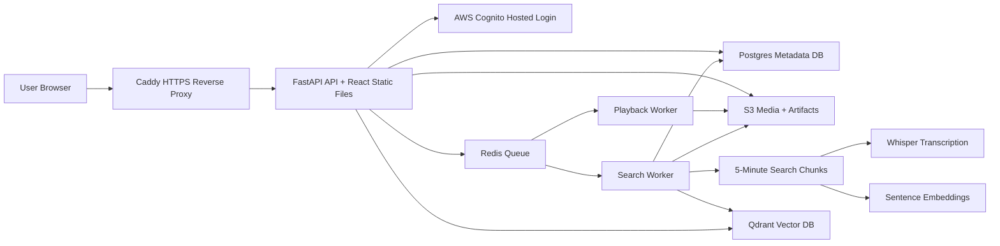

# Vindex

Vindex is an AWS-deployed video semantic search platform for long-form video. Authenticated users upload videos, asynchronous workers build timestamped transcript embeddings, and users can search inside videos semantically and jump directly to matching moments.

The project is designed as a job-hunting portfolio system: it demonstrates backend APIs, async workers, object storage, vector search, auth, metrics, Docker deployment, HTTPS hosting on AWS, and a measured pipeline redesign from a monolithic worker into a chunked DAG that scales with CPU workers.

## What It Does

- Upload a video with a title and private/public visibility.
- Store raw and processed media in S3.
- Process videos asynchronously with Celery and Redis.
- Compress video and extract audio with FFmpeg.
- Transcribe audio with Whisper.
- Generate transcript segments and sentence embeddings.
- Store searchable vectors in Qdrant.
- Search video content semantically or with text-based matching.
- Split playback processing and search indexing into independent Celery DAG branches.
- Split long videos into 5-minute search chunks, retry failed chunks independently, and mark videos searchable only after all chunks complete.
- Track meaningful metrics such as upload latency, processing time, Whisper time, embedding time, Qdrant search latency, and S3 timing.
- Manage database schema changes with Alembic migrations.
- Serve a React frontend through FastAPI.
- Authenticate users with AWS Cognito.
- Host publicly with Caddy-managed HTTPS on EC2.
- Delete videos with cleanup across Postgres, S3, Qdrant, and metrics.

## Performance Benchmark Highlights

Primary benchmark video: `test_video.mp4`, 19.3 minutes, split into 4 search chunks.

| Experiment | Time-to-searchable | Result |
| --- | ---: | --- |
| Original online baseline on EC2 `t3.medium` | 226.74s | Baseline before DAG/chunking |
| Chunked DAG on EC2 `t3.medium`, 1 search worker | 172.97s | 23.7% faster |
| Chunked DAG on EC2 `t3.medium`, 2 search workers | 216.41s | Slower due to CPU contention |
| Chunked DAG on EC2 `c7i.2xlarge`, 1 search worker | 101.79s | Larger CPU, no worker parallelism |
| Chunked DAG on EC2 `c7i.2xlarge`, 2 search workers | 58.84s | Two chunks processed concurrently |
| Chunked DAG on EC2 `c7i.2xlarge`, 4 search workers | 40.73s | Best tested point for a 4-chunk video |

The strongest measured result was:

```text
226.74s original online baseline -> 40.73s chunked DAG with 4 search workers
```

That is an 82.0% reduction in time-to-searchable. Full benchmark notes are in [`benchmarks/pipeline_stats_summary.md`](benchmarks/pipeline_stats_summary.md).

## Architecture



## AWS Deployment Shape

Current deployment:

```text
Internet
-> https://vindex.32-193-233-124.sslip.io
-> Elastic IP
-> EC2 t3.medium
-> Caddy on ports 80/443
-> FastAPI container on internal port 8000
-> Celery worker / Redis / Postgres / Qdrant containers
-> S3 bucket for media artifacts
-> Cognito for auth
```

Port `8000` is not publicly exposed. Public traffic goes through HTTPS on Caddy.

## Core Services

| Service | Role |
| --- | --- |
| FastAPI | API routes, auth checks, upload/search/status/delete endpoints |
| React + Vite | Frontend app for upload, library, playback, search, metrics |
| Celery | Background video processing |
| Redis | Celery broker/result backend |
| Postgres | Video/user metadata |
| Alembic | Versioned Postgres schema migrations |
| S3 | Raw video, processed video, audio, transcripts, segments, embeddings, thumbnails, metrics |
| Qdrant | Segment vector search |
| Cognito | User login and identity |
| Caddy | HTTPS reverse proxy and certificate renewal |

## Important Endpoints

| Endpoint | Purpose |
| --- | --- |
| `GET /health` | Service health |
| `GET /me` | Current authenticated user |
| `GET /videos` | Current user's videos |
| `GET /public/videos` | Public video feed |
| `POST /videos/upload` | Upload video |
| `GET /videos/{video_id}/status` | Processing status |
| `GET /videos/{video_id}/transcripts` | Transcript |
| `GET /videos/{video_id}/segments` | Transcript segments |
| `POST /videos/{video_id}/search` | Search inside a video |
| `GET /videos/{video_id}/metrics` | Performance metrics |
| `GET /videos/{video_id}/file-url` | Auth-checked temporary playback URL |
| `GET /videos/{video_id}/thumbnail-url` | Auth-checked temporary thumbnail URL |
| `DELETE /videos/{video_id}` | Delete video and cleanup artifacts |

## Local Development

Create `.env` from `.env.example`, then fill in the AWS and Cognito values.

```powershell
docker compose up --build -d
curl.exe http://localhost:8000/health
```

Open:

```text
http://localhost:8000/
```

For local Cognito testing, keep this callback in Cognito:

```text
http://localhost:8000/
```

## EC2 Deployment

Start the EC2 instance:

```powershell
aws ec2 start-instances --instance-ids i-0c8b8004f6e34e2e9 --region us-east-1
```

SSH:

```powershell
ssh -i "$HOME\.ssh\vindex-ec2-key.pem" ubuntu@32.193.233.124
```

Deploy:

```bash
cd ~/Vindex
git pull --ff-only origin main
docker compose up --build -d
docker compose ps
curl http://localhost:8000/health
```

The API container runs `alembic upgrade head` before starting Uvicorn, so schema changes are applied during deployment.

Public URL:

```text
https://vindex.32-193-233-124.sslip.io/
```

Stop the instance when done:

```powershell
aws ec2 stop-instances --instance-ids i-0c8b8004f6e34e2e9 --region us-east-1
```

## Cognito Setup

The Cognito app client must include these callback/logout URLs:

```text
http://localhost:8000/
https://vindex.32-193-233-124.sslip.io/
```

The frontend build uses `VITE_COGNITO_REDIRECT_URI`, so if the redirect changes, rebuild the Docker image:

```bash
docker compose up --build -d
```

## Delete Lifecycle

Deleting a video removes:

- Postgres video row.
- S3 raw video.
- S3 processed video.
- S3 extracted audio.
- S3 transcript.
- S3 segment JSON.
- S3 embedding JSON.
- S3 thumbnail.
- S3 metrics JSON.
- Qdrant vectors for that video.

Deletion is owner-only. Active videos in `uploaded` or `processing` state are blocked from deletion to avoid racing the Celery worker.

## Database Migrations

Vindex uses Alembic for versioned Postgres schema migrations.

Useful commands:

```bash
alembic upgrade head
alembic current
alembic history
```

The first migration is intentionally idempotent because early versions of Vindex created tables at startup. This lets existing EC2 databases adopt Alembic without dropping existing data.

## Metrics

Vindex stores metrics per video in S3:

- Upload response latency.
- Raw S3 upload time.
- Total processing time.
- Time until searchable.
- Whisper transcription time.
- Embedding generation time.
- Qdrant upsert time.
- Thumbnail generation time.
- Query embedding time.
- Qdrant search latency.
- Top search score.

These metrics are meant to support performance tuning and interview discussion.

## Design Tradeoffs

Current MVP choices:

- Docker Compose on one EC2 instance keeps cost and operational complexity low.
- Redis/Celery demonstrates async processing without introducing managed queue cost.
- Local Postgres/Qdrant containers make the system easy to recreate.
- S3 is used for durable media/artifact storage.
- Caddy provides HTTPS without an Application Load Balancer.

Production evolution:

- Move Postgres to RDS.
- Move Redis to ElastiCache or replace Celery/Redis with SQS-backed workers.
- Run API and workers on ECS.
- Expand CI/CD beyond smoke checks into automated deployment.
- Add rate limiting and stronger upload validation.
- Add managed observability with CloudWatch dashboards/alarms.

## Cost Controls

- Stop EC2 when not demoing.
- Remember the Elastic IP/public IPv4 address still has a small monthly cost while reserved.
- Keep media test files small.
- Delete unused videos through the app to clean S3 and Qdrant.

## Roadmap

- Model warmup and search latency optimization.
- Better landing/demo page.
- Custom domain replacing the temporary `sslip.io` hostname.
